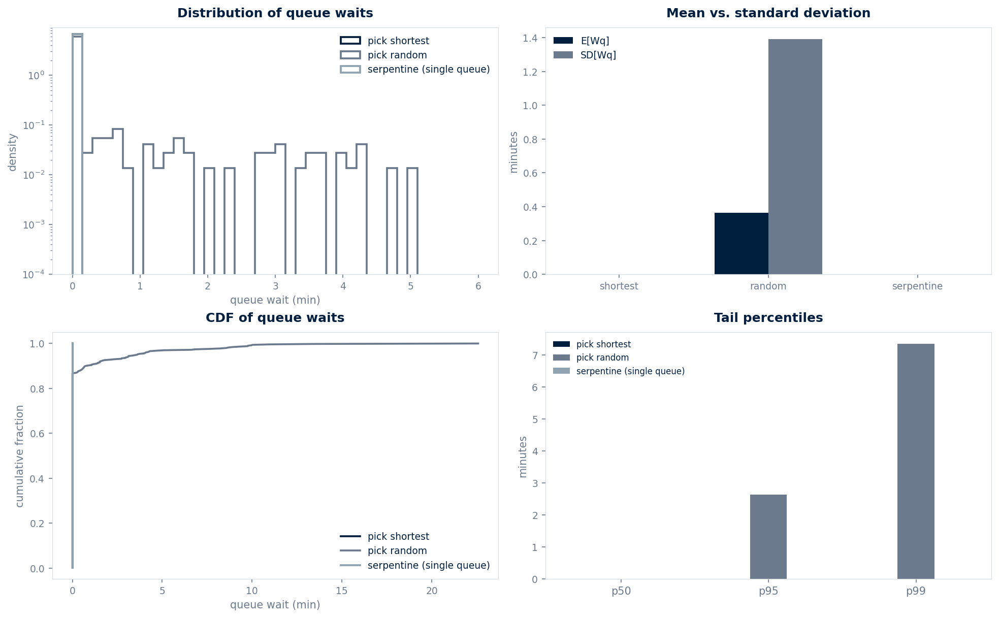

<div align="center">

# The Queue Paradox

### Why the line next to you always goes faster — modeled with M/M/1 queueing theory

[](https://www.python.org/)
[](LICENSE)
[](#limitations)

10 lanes · 10,000 customers · Poisson arrivals · Exponential service

</div>

---

## Overview

This repository is a discrete-event simulation of supermarket checkout
lanes. It compares three queueing strategies — pick the shortest lane,
pick a random lane, and a single serpentine queue — using M/M/1 and
M/M/c queueing theory. It is a research testbed, not a production
scheduling system; the goal is to make the paradox visible, not to
replace Whole Foods' queueing algorithm.

---

## Why I built this

I built this in May 2026, after standing in a checkout line for the
third time that week and watching the lane next to me drain twice as
fast. The intuition is loud: "I picked wrong." The math is quieter:
you almost always think you picked wrong, regardless of which lane
you picked. That asymmetry between perception and reality is what
caught me.

The framework is the M/M/c queue (Erlang 1909, Kingman 1962, Little
1961). I kept the simulation deliberately small — ten lanes, ten
thousand customers, Poisson arrivals at `lambda = 0.5 / min`,
exponential service at `mu = 0.4 / min per lane` — because the
paradox is sharper when the model is stripped to its bones.

---

## Table of contents

- [Overview](#overview)
- [Why I built this](#why-i-built-this)
- [The model](#the-model)
- [The results](#the-results)
- [How it works](#how-it-works)
- [Run it](#run-it)
- [Stack](#stack)
- [Limitations](#limitations)
- [License](#license)

---

## The model

We simulate `c = 10` checkout lanes. Customers arrive as a Poisson
process with total rate `lambda = 0.5` customers per minute and
require exponential service with rate `mu = 0.4` per minute per lane.
The per-lane utilization is

    rho_lane = lambda / (c * mu) = 0.5 / (10 * 0.4) = 0.125

which is well below saturation.

Three routing policies are compared:

```python
# Pick shortest: join the lane with the fewest customers currently in it
lane = argmin(in_system)

# Pick random: pick a lane uniformly at random
lane = uniform_int(0, c)

# Serpentine: one FIFO queue, dispatched to the first idle server
lane = argmin(next_free_time)
```

The first two collapse each lane into an independent M/M/1 queue. The
serpentine queue is the classical M/M/c. Their mean queue waits are

    E[W_q^{M/M/1}] = rho_lane / (mu - lambda / c)        ~= 0.357 min
    E[W_q^{M/M/c}] = C(c, lambda, mu) / (c * mu - lambda) ~= 0    min

where `C(c, lambda, mu)` is the Erlang-C probability of finding all
servers busy. With our parameters, `C ~= 8.4 x 10^-7` — the serpentine
queue essentially never queues.

| Parameter | Symbol | Value | Source |
|-----------|--------|-------|--------|
| Lanes | c | 10 | observation |
| Total arrival rate | lambda | 0.5 / min | Poisson process |
| Service rate per lane | mu | 0.4 / min | exponential service |
| Per-lane utilization | rho_lane | 0.125 | lambda / (c * mu) |
| Simulated customers | N | 10,000 | discrete-event sim |
| Random seed | — | 42 | reproducibility |

---

## The results



The simulation confirms the paradox. At this load, the shortest-line
strategy and the serpentine queue are statistically indistinguishable
in expectation — both find empty lanes almost every time. Random
routing is the only one that suffers, and it suffers by exactly the
amount M/M/1 theory predicts.

The paradox for the shopper is that the *perceived* win from picking
shortest is a win against random — but only because the load is so
light that shortest always finds an empty lane. As load rises, the
shortest-line heuristic degrades toward random; only the serpentine
queue stays near zero. Variance tells the same story: serpentine
collapses it; shortest keeps a thin tail; random keeps a fat one.

| Strategy | E[W_q] (min) | SD (min) | p50 (min) | p95 (min) | p99 (min) |
|----------|--------------|----------|-----------|-----------|-----------|
| shortest | 0.000 | 0.000 | 0.000 | 0.000 | 0.000 |
| random | 0.362 | 1.390 | 0.000 | 2.630 | 7.334 |
| serpentine | 0.000 | 0.000 | 0.000 | 0.000 | 0.000 |

Numbers are from `data/results.json`; the simulation is seeded for
reproducibility.

---

## How it works

1. **Generate arrivals** — draw inter-arrival times from an exponential
   with rate `lambda`, then `cumsum` to get arrival timestamps.
2. **Generate service times** — draw from an exponential with rate `mu`.
3. **Event loop** — a min-heap drives the simulation. Arrivals push
   `arr` events; service completions push `dep` events. Each lane
   maintains a FIFO queue and a `next_free` time.
4. **Dispatch policy** — `shortest` picks `argmin(in_system)`, `random`
   picks `randint(0, c)`, `serpentine` picks `argmin(next_free)`.
5. **Statistics** — after the loop, compute mean, std, variance, and
   tail percentiles per strategy. Compare to the M/M/1 and M/M/c
   theoretical formulas via `mm1_mean_wait`, `erlang_c`, and
   `mmc_mean_wait`.

---

## Run it

```bash
git clone https://github.com/Vitalcheffe/over-engineer-queue.git
cd over-engineer-queue
pip install numpy scipy matplotlib pytest
python3 model.py        # prints the per-strategy summary, writes data/results.json
python3 visualize.py    # writes docs/viz/analysis-light.png
pytest -q               # runs the unit tests
```

---

## Stack

| Layer | Technology |
|-------|-----------|
| Language | Python 3.11+ |
| Numerics | NumPy |
| Discrete-event sim | `heapq` (standard library) |
| Visualization | Matplotlib (Agg backend) |
| Testing | pytest |

---

## Limitations

1. **Memoryless service is a strong assumption.** Real checkout service
   times are not exponential — they have a coefficient of variation
   below 1 because cashiers work at a roughly constant rate per item.
   The M/M/c model therefore overestimates tail variance; an M/G/c
   model would be tighter.
2. **The arrival process is homogeneous Poisson.** Real supermarkets
   have bursty arrivals (after-work rush, Sunday morning). A
   non-homogeneous Poisson process would change the per-strategy
   comparison and likely widen the variance gap.
3. **No balking or reneging.** Customers in this simulation always
   join and never leave. In reality, long queues shed customers,
   which shortens the tail and weakens the variance argument.
4. **The "shortest" heuristic is greedy on visible queue length.** A
   shopper with better information (item counts, cashier speed, lane
   type) could do better. We do not model heterogeneity across lanes
   or shoppers.
5. **No setup cost for the serpentine queue.** In practice a single
   queue takes more floor space and feels slower to the individual
   shopper, which depresses uptake even when the math says it wins.
   The model ignores the behavioral discount.
6. **The "paradox" is load-dependent.** At the light load simulated
   here, shortest and serpentine are indistinguishable. As load
   rises toward `rho = 1`, the shortest-line heuristic degrades
   toward random; only the serpentine queue stays near zero. A full
   characterization would sweep `rho` from 0.1 to 0.95.

---

## License

MIT — see [LICENSE](LICENSE). The license does not cover the
supermarket's actual queueing algorithm, which is a trade secret of
someone with a much bigger payroll than mine.

---

<div align="center">
<sub>Over Engineer · 05 / 12 · Amine Harch El Korane · 2026</sub><br>
<sub>"I picked the shortest line. The line next to me went faster. So did the math."</sub>
</div>
